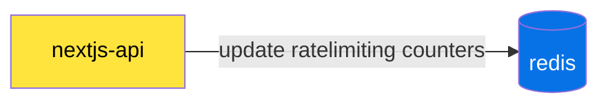
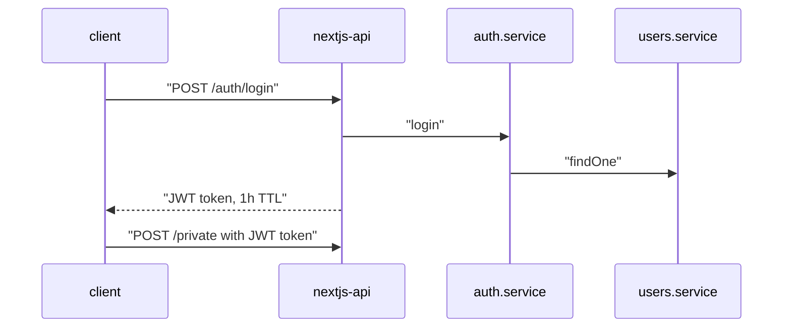
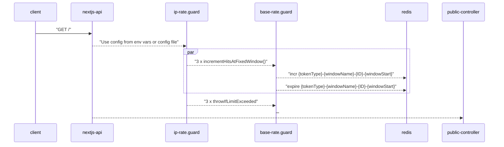
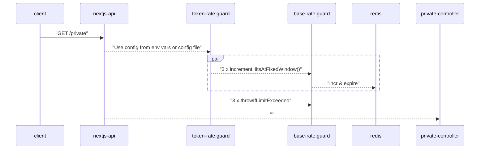

# nestjs authentication / ratelimiting sandbox

[](https://www.youtube.com/watch?v=3efkQ7wpRtE)

## Usage
```bash
docker-compose -f docker-compose.redis.yml -f docker-compose.yml up -d && open "http://localhost:3000"
```

## Architecture

### Ratelimiting
Service (nextjs-api) uses synchroneous ratelimiting stored in redis, using [fixed window logic](https://developer.redis.com/develop/java/spring/rate-limiting/fixed-window/)
This allows multiple instances of service to have centralized ratelimiting per tier.
Also, 3 fixed windows are used (per second, per minute and per hour), which means that not all hourly limits are available immediately.

Pros
- simple to implement
- memory-efficient
- spikes are handled with smaller window 

Cons
- redis is a critical service, service has no fallback if its not operational
- quite high redis load
- precision is not great, compared to sliding window

### Service diagram


### Sequence diagrams
#### Authentication


#### Public endpoint ratelimiting




#### Private endpoint ratelimiting



### Configuration
Env variables can be passed via docker-compose.yml

| Variable Name         | Description                                            | Default |
| --------------------- |--------------------------------------------------------|---------|
| IP_LIMIT_PER_SEC               | Max amount of requests per second for public endoints  | 10      |
| IP_LIMIT_PER_MIN           | Max amount of requests per minute for public endoints  | 60      |
| IP_LIMIT_PER_HOUR           | Max amount of requests per hour for public endoints    | 100     |
| TOKEN_LIMIT_PER_SEC           | Max amount of requests per second for private endoints | 20      |
| TOKEN_LIMIT_PER_MIN           | Max amount of requests per minute for private endoints  | 120     |
| TOKEN_LIMIT_PER_HOUR           | Max amount of requests per hour for private endoints    | 200     |

### REST API
#### Public routes
🟡 `POST /auth/login`

returns access (jwt) token you can use in private routes
```bash
curl -X POST 'http://localhost:3000/auth/login' -d '{"username": "admin", "password": "pass"}' -H "Content-Type: application/json"
```

🟢 `GET /`

🟢 `GET /one`

🟢 `GET /two`

🟢 `GET /five`

#### Private routes - Access (jwt) token protected
Pass `Authorization: Bearer ...` access token you got from /auth/login
```bash
curl http://localhost:3000/private -H "Authorization: Bearer access-token"
```

🟢 `GET /private/one`

🟢 `GET /private/profile`

## Development

```bash
npm install
docker-compose -f docker-compose.redis.yml up -d
npm run start:dev
```

### Running the app

```bash
# development
$ npm run start

# watch mode
$ npm run start:dev

# production mode
$ npm run start:prod
```

## Testing

```bash
# unit tests
$ npm run test

# ratelimiting tests
$ npm run test:e2e

# test coverage
$ npm run test:cov
```

## License

Service code is [AGPL licensed](LICENSE).
